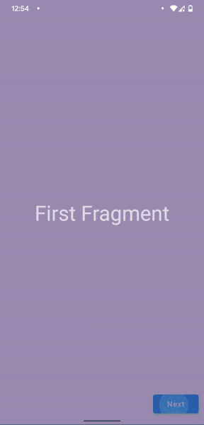
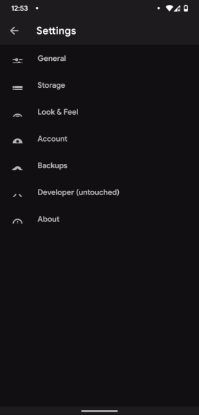

# Backpress sample

A sample that is focused on the correct usage of backpress events.

All the back press events are flowed from activity to fragments & their child fragments (if any). This is done by calling `canGoBack` on `navigator` to determine if it's okay to go back. Once all the fragments return `False` i.e there is no fragment in the backstack of the activity or any child fragment, the host's (activity) `super.onBackPressed()` is called.

The sample also focus on a specific animation `CircularTransform`, for eg: take a look at the sample app gif.

<>

<>

Apps can be creative & can use this transition to change theme as well. For eg: [Moviesy](https://github.com/KaustubhPatange/Moviesy) does it like the following.

<>

<>
